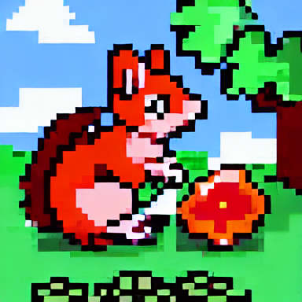
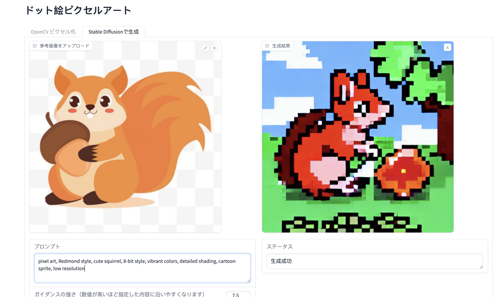
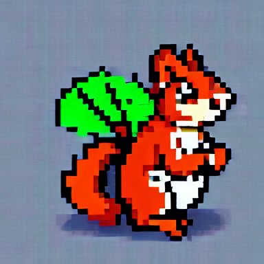
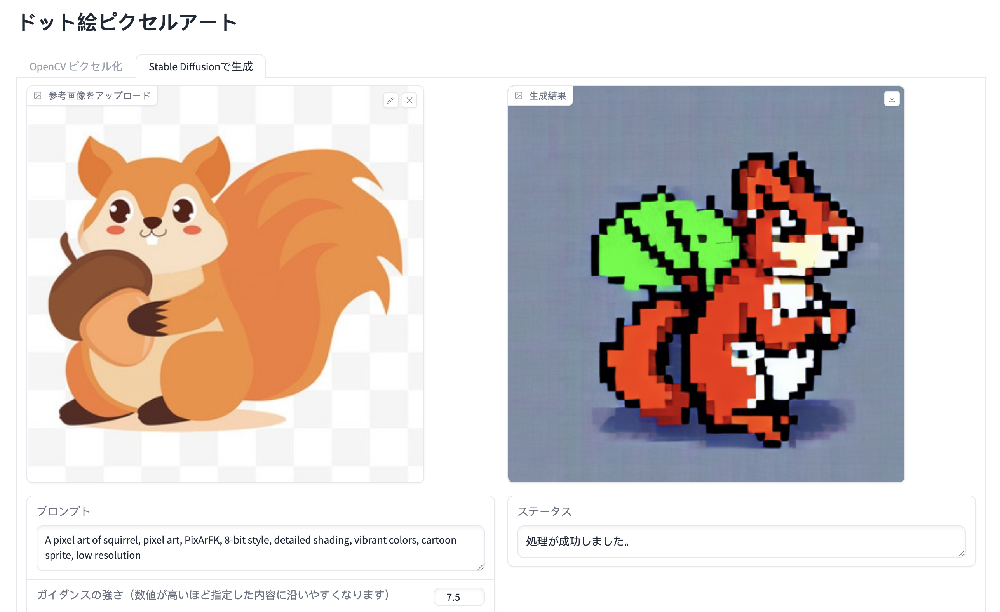
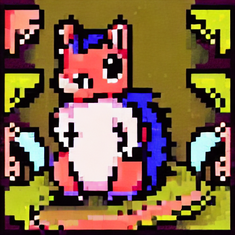
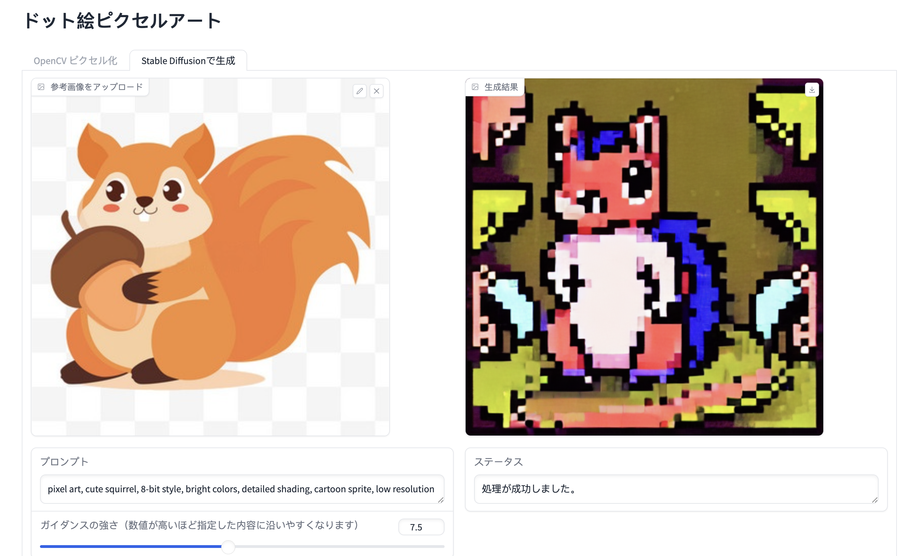
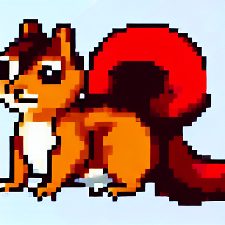
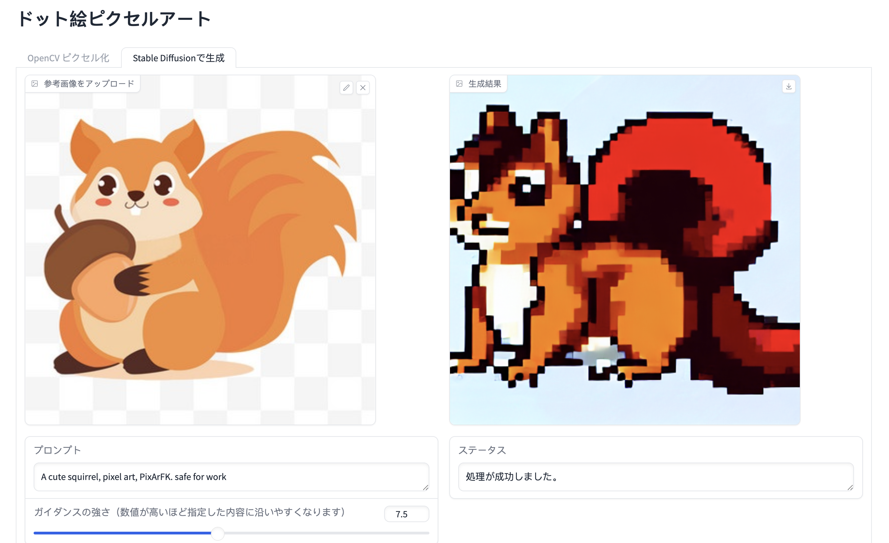

# 🎨 Pixel Art Generator

An AI-based pixel art generator that transforms hand-drawn sketches into pixel-style artworks.

> 🚀 This project uses `Gradio==3.44.4`. Please use this specific version to avoid compatibility issues.

---

## 🌟 Features

- Convert hand-drawn sketches into pixel-style images  
- Optional text prompt to guide the generation  
- Real-time generation progress display  
- Simple and intuitive web UI (built with Gradio)  

---

## 📦 Installation

```bash
git clone [your-repo-url]
cd pixel-art-generator
conda create -n pixel_venv python=3.12
conda activate pixel_venv
pip install gradio==3.44.4
pip install -r requirements.txt
pip install torch torchvision opencv-python pillow
pip install git+https://github.com/facebookresearch/segment-anything.git
🛠️ Usage
Upload or draw a sketch

(Optional) Enter a text description

Click the generate button

Wait for the pixel art to appear 🎉

💻 System Requirements
Python 3.10 or 3.12

Conda (recommended)

8GB+ RAM

Modern browser (Chrome / Firefox / Safari)

CUDA (optional, for GPU acceleration)

⚠️ Notes
Simple line drawings work best

Do not refresh the page during generation

If error occurs, ensure gradio==3.44.4 is installed

🧱 Tech Stack
FastAPI

Gradio

Diffusers

Transformers

PyTorch

Segment Anything

OpenCV, Pillow

📄 License
MIT License

<details> <summary>📘 中文版说明（点击展开）</summary>
🎨 像素画生成器
一个基于 AI 的像素画生成器，可以将手绘草图转换为像素风格的艺术作品。

🚀 本项目使用 Gradio==3.44.4，请确保安装此版本以避免兼容性问题。

🌟 功能特点
将手绘草图转换为像素风格图片

支持输入文本提示词引导生成

实时显示生成进度

简洁直观的 Web 界面（基于 Gradio）

📦 安装与使用
按照英文版步骤运行即可。

</details> <details> <summary>📙 日本語版の説明（クリックで展開）</summary>
🎨 ピクセルアート・ジェネレーター
手描きのスケッチをピクセル風のアートに変換する AI ツールです。

🚀 このプロジェクトは Gradio==3.44.4 を使用しています。互換性のため、必ずこのバージョンを使用してください。

🌟 特徴
スケッチをピクセルアートに変換

テキストプロンプトの入力も可能

生成中の進行状況を表示

シンプルで使いやすい Gradio ベースの UI

📦 インストールと使用方法
英語版の手順をご参照ください。

</details>
🖼️ 画像の生成例（Sample Outputs）
以下は、実際に本ツールで生成されたピクセルアートの例です：

<p align="center">   </p> <p align="center">   </p> <p align="center">   </p> <p align="center">   </p>
生成結果は、入力したスケッチとプロンプトに応じて変化します。シンプルな線画ほど良好な変換結果が得られます。

